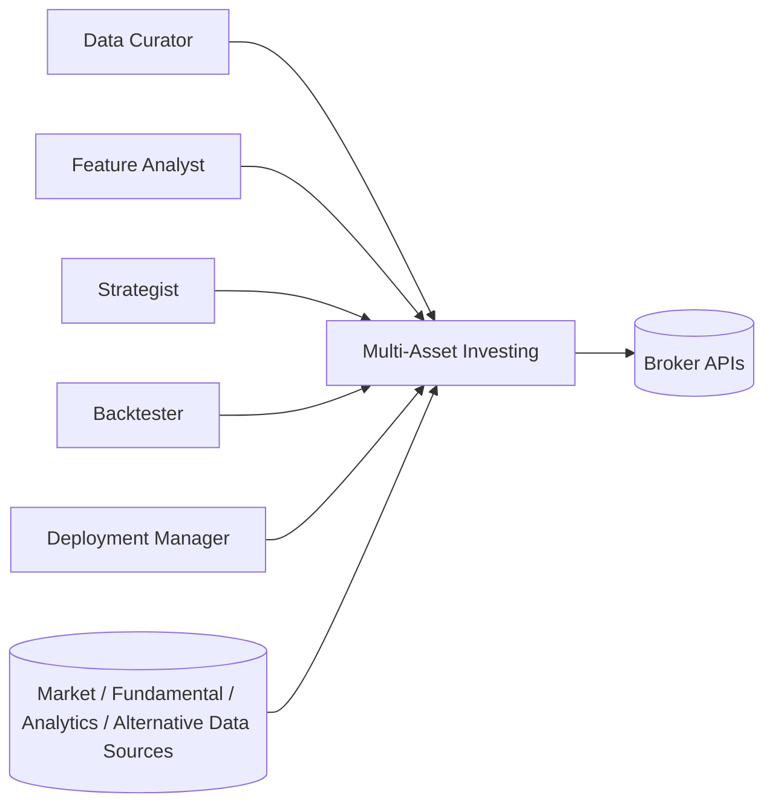
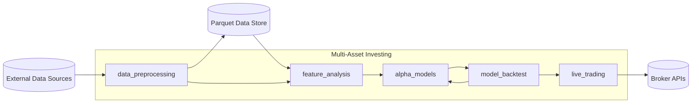
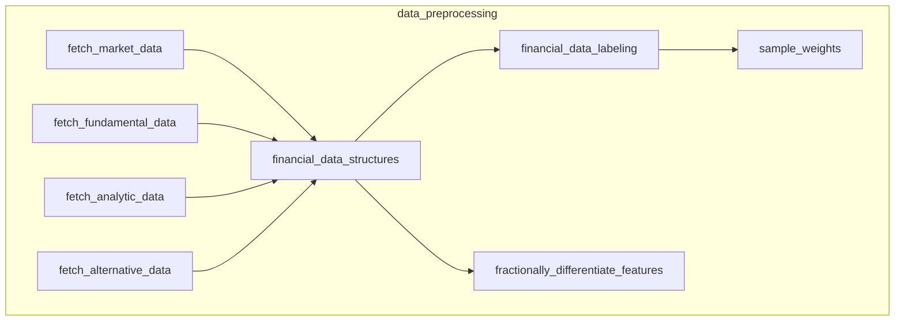
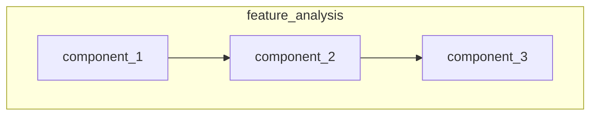
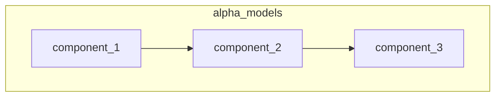
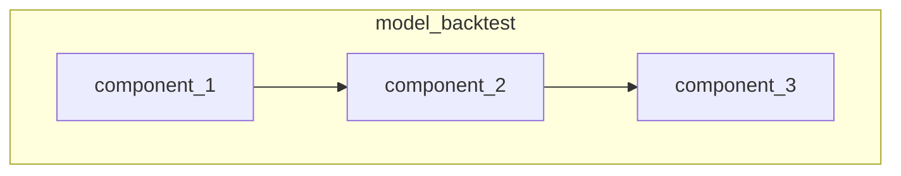
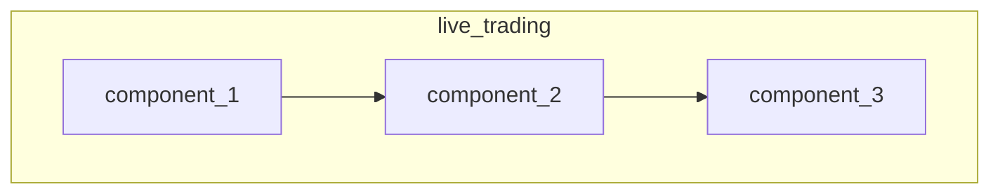

# System Architecture

## 1. Technology Stack

| Component | Technology               |
|-----------|--------------------------|
| Research  | Python, Jupyter Notebook |
| Execution | CCXT                     |

## 2. Architecture Diagrams

### 2.1 Context Diagram

### 2.2 Container Diagram

### 2.3 Component Diagram

#### 2.3.1 data_preprocessing

#### 2.3.2 feature_analysis

#### 2.3.3 alpha_models

#### 2.3.4 model_backtest

#### 2.3.5 live_trading

